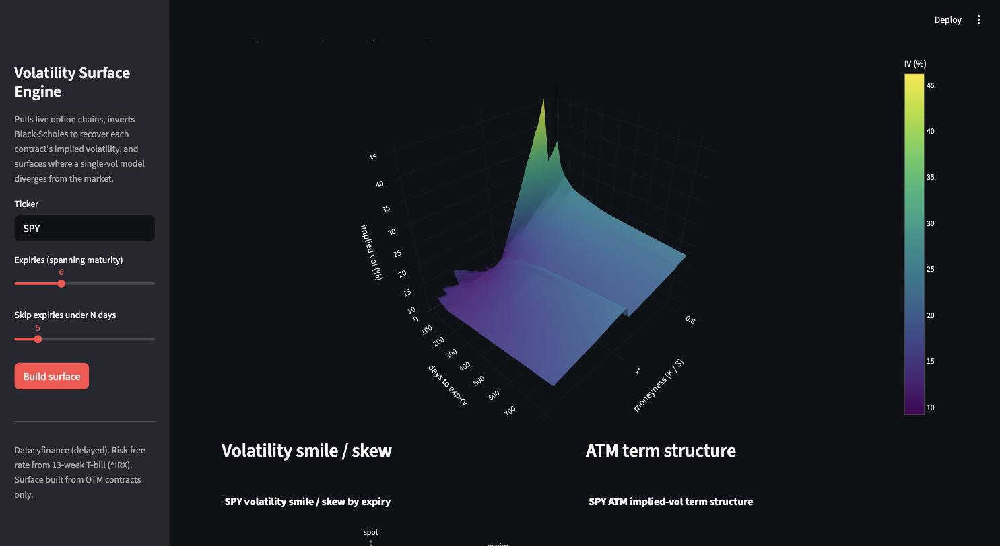

# Options Pricing & Volatility Surface Engine

[](https://github.com/James-J-Barry/OptionsPricingCalculator/actions/workflows/tests.yml)

A Python engine for pricing options and analyzing implied volatility using live market data.



## What it does

- Pulls live option chains, spot price, dividend yield, and the risk-free rate (13-week T-bill) via `yfinance`.
- Cleans the data: drops stale/illiquid quotes (crossed markets, wide spreads, no open interest) and logs why each was dropped.
- Solves implied volatility from market prices by inverting Black-Scholes (Newton-Raphson with a Brent fallback), rather than assuming a volatility.
- Computes analytic Greeks (Δ, Γ, vega, Θ, ρ).
- Compares a flat-volatility model to the market to quantify the volatility skew/smile.
- Prices path-dependent options (Asian, barrier) via a Monte Carlo simulator with variance reduction and confidence intervals.
- Fits the volatility surface two ways — an SVI parametric model and a gradient-boosted ML model — and benchmarks both against the flat-vol baseline on live data.
- Serves the whole thing through a Streamlit web app (3D vol surface, smile/term-structure plots, divergence table) and a CLI.

## Example

```
$ python cli.py SPY
SPY  spot=754.90  expiry=2026-06-23  T=0.022y  r=3.62%  q=0.98%
ATM implied vol (solved): 10.03%
Priceable contracts: 164

Largest flat-vol model vs market divergences across OTM contracts:
   put K=753.00   mkt=   5.27  flat-BS=   3.41  diff=  -1.86  IV=14.3%
   put K=750.00   mkt=   4.15  flat-BS=   2.30  diff=  -1.85  IV=14.5%
   ...
```

On live SPY data, the flat-vol model misses the market by ~15 IV points; the SVI and ML surface models track it to within ~1-1.3 points.

## Usage

```bash
pip install -r requirements.txt

streamlit run app.py             # interactive web app

python cli.py AAPL               # nearest tradeable expiry
python cli.py SPY --expiry 2026-07-17
python cli.py NVDA --expiries    # list available expiries
python cli.py AAPL --show-drops  # show the data-cleaning report
```

Teaching notebooks in `notebooks/` walk through the finance and math from scratch:

1. `01_understanding_the_project.ipynb` — options, Black-Scholes, implied vol
2. `02_volatility_surface.ipynb` — smile, term structure, the full surface
3. `03_monte_carlo.ipynb` — simulation, convergence, Asian/barrier options
4. `04_benchmark.ipynb` — flat-vol vs. SVI vs. ML on live data (needs internet)

## Project layout

```
optvol/
  data.py                  live chain pull, cleaning, risk-free rate
  analyze.py               IV solving + Greeks + divergence assembly
  surface.py               multi-expiry surface: smile, term structure, grid
  plots.py                 reusable Plotly figures
  pricing/
    black_scholes.py       vectorized price + analytic Greeks
    implied_vol.py         Newton/Brent IV inversion
    monte_carlo.py         GBM simulation; European/Asian/barrier pricers
  surface_models/
    svi.py                 SVI parametric smile fit + no-arbitrage checks
    ml.py                  gradient-boosted IV(moneyness, T) model
app.py                      Streamlit web app
cli.py                       command-line entry point
tests/                       put-call parity, IV round-trip, FD-checked Greeks
```

## Tests

```bash
PYTEST_DISABLE_PLUGIN_AUTOLOAD=1 python -m pytest tests/ -q
```

Covers put-call parity, IV round-trip recovery across a strike/vol grid, no-arbitrage rejection of unpriceable quotes, and finite-difference validation of analytic vega.
